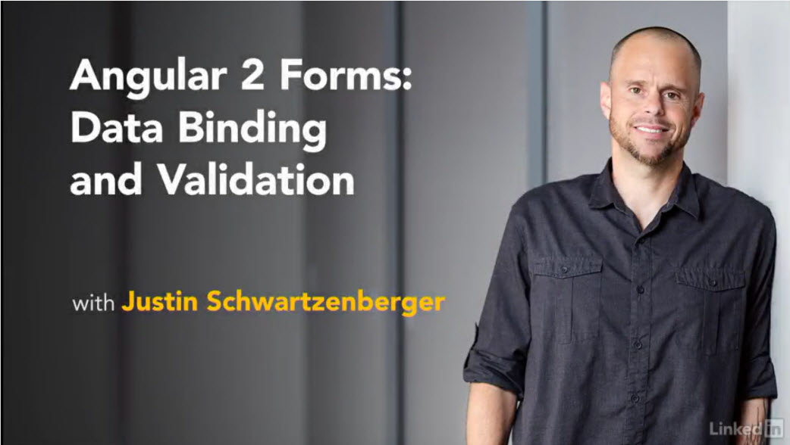

# Angular 2 Forms: Data Binding and Validation

  

This is the repository for my course, [Angular 2 Forms: Data Binding and Validation](https://www.lynda.com/AngularJS-tutorials/Angular-2-Forms-Data-Binding-Validation/461451-2.html). 
The full course is available at [lynda.com](https://lynda.com).  

## Course Description

Building HTML forms in the web world is never as straightforward as expected. Collecting user input and implementing dynamic form validation, 
that automatically reacts to input, can be difficult without the right solution. When building client side apps using Angular you get a good 
amount of framework code out of the box that makes working with forms a breeze. Angular allows you to easily handle dynamic form validation 
by taking advantage of two-way data-binding functionality.  

This course shows how to build HTML web forms with the Angular forms module, using Angular form building blocks and built-in validation 
properties and methods. Learn how to use the reactive (model-driven) forms approach to build out a model representation of form data in code and 
bind it to native HTML form elements. This course also explores how to implement validation, using JavaScript, in case you need more 
fine tuned control of your interactions.  

## Instructions

1. Make sure you have these installed
  - [node.js](http://nodejs.org/)
  - [git](http://git-scm.com/)
  - [gulp](https://github.com/gulpjs/gulp/blob/master/docs/getting-started.md)
2. Clone this repository into your local machine using the terminal (mac) or Gitbash (PC) 

    `git clone https://github.com/coursefiles/angular2-reactive-forms-data-and-validation.git`
    
3. CD to the folder

    `cd angular2-reactive-forms-data-and-validation`
    
4. Run the following to install the project dependencies:

    `npm install`
    
5. Run the npm start command to build the code, watch for file changes, and serve up the site locally:

    `npm start`

The repository has a branch for each video starting point. For example, the branch **02-01b** is used as the starting code for the video *02-01 Input type text*. You can checkout branches using `git checkout <branchname>` and not have to re-run `npm install` each time since you will remain in the same root folder.

Note that the site will run using `gulp-webserver` and will be served up at the following local address:  
    http://localhost:8000/

*If you use a code editor that launches its own web server please note that it may run on a different port number. 
You will want to use `npm start` for this project.*

## More Stuff
Check out some of my [other courses on lynda.com](https://lynda.com/justinschwartzenberger). 
You can also [follow me on twitter](https://twitter.com/schwarty), or read [my blog](http://schwarty.com).